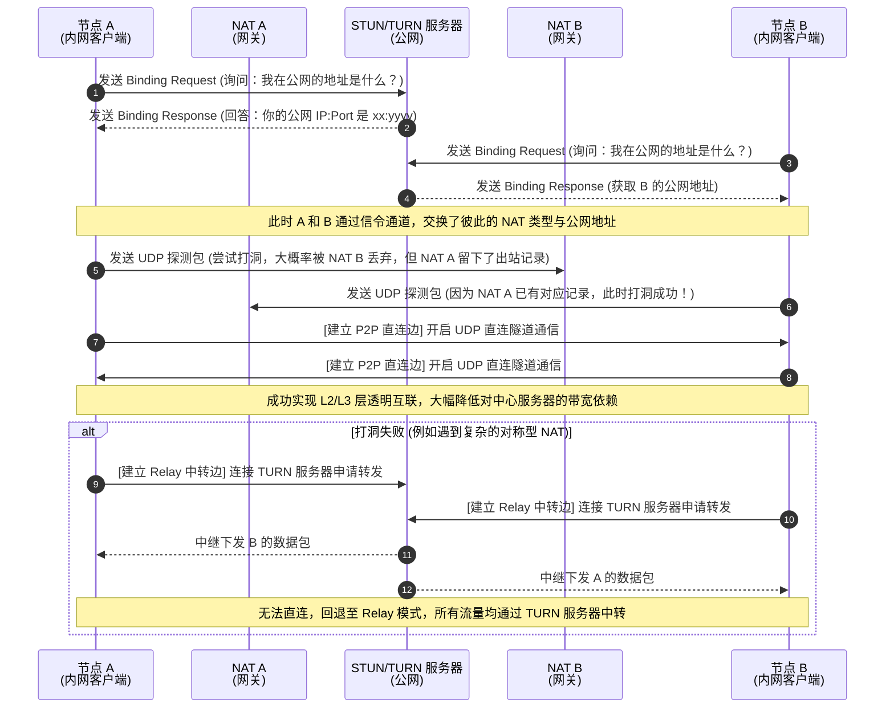

### 背景与意义

在当前数字化转型、边缘计算与工业物联网（IIoT）迅速普及的宏观背景下，海量设备的接入与跨地域协同办公已成为常态。然而，由于全球 IPv4 地址的日益枯竭，网络运营商广泛采用大规模的运营商级 NAT（CGNAT）技术，导致终端设备普遍隐藏在复杂的对称型或端口受限锥型 NAT 之后，使得传统的端到端直接寻址与通信面临极大的底层网络阻力。

为了突破这一跨域组网的核心瓶颈，本项目创新性地引入了软件定义网络（SDN）的设计思想，致力于构建一个高性能、零配置（Zero-Config）且可视化的异地私有网络构建平台——NetWeaver。该平台旨在实现透明化的 L2/L3 层网络互联，打破广域网的物理隔离，使异地设备能够直接相互 Ping 通；同时优先采用 UDP Hole Punching 技术建立 P2P 直连隧道，大幅降低对中心服务器的带宽依赖。NetWeaver 致力于为分布式开发团队、IIoT 运维人员以及私有云用户提供一个高可用、高安全的基础网络底座。

### 痛点分析

面对日益增长的跨地域组网需求，现有的工业界与开源界解决方案在实际工程落地中普遍暴露出以下核心局限性：

* **中心化架构引发性能与成本瓶颈：** 传统的中心化 VPN（如 OpenVPN、IPsec）深度依赖中心服务器进行全量流量的中转（Hub-and-Spoke 架构）。随着边缘节点规模的扩大，中心节点极易成为绝对的性能瓶颈，不仅推高了带宽成本，还会引发严重的数据包绕行（Hairpinning）与极高的端到端网络延迟。
* **闭源安全风险与国内网络适配弱：** 主流商业或半开源竞品（如 ZeroTier、Tailscale）的核心信令控制节点通常为闭源状态且部署于海外，对高敏感度的政企用户而言存在隐私泄露与数据出境的安全隐患。此外，在国内复杂的运营商环境下，这些工具默认的中转服务器常面临高延迟与丢包问题，且难以进行低成本的节点自建与定制。
* **配置运维复杂与管理黑盒化：** 现代协议标准（如 WireGuard）虽具备优异的传输性能，但未内置完善的 NAT 穿透协调机制。面对复杂的 NAT 拓扑，用户仍需手动配置繁杂的路由表与防火墙规则。且现有工具大多依赖命令行（CLI）操作，缺乏直观的拓扑管理与实时状态监测机制，导致运维成本高昂且处于“黑盒”状态。
* **弱网环境下的传输崩溃（TCP Meltdown）：** 在存在高延迟与高丢包率的真实广域网中，若在底层隧道内继续套用 TCP 协议进行封装，极易触发内层业务与外层隧道的拥塞控制重叠碰撞，引发指数级回退，导致传输速率与带宽利用率断崖式下跌。